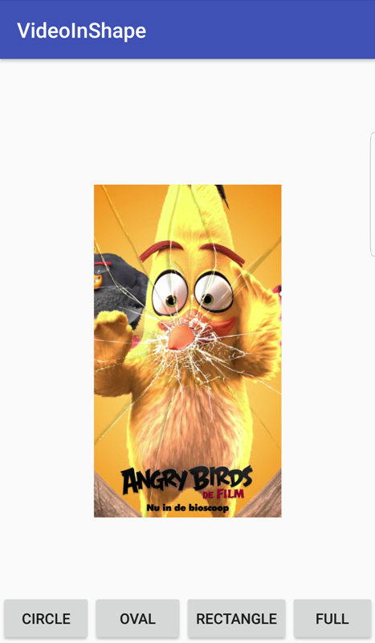

# VideoInShape
Demonstrates video cropping in different shapes in Android.

The project uses custom SurfaceView to provide different shapes for cropping a video. Video can be cropped while video is playing 🙌.

One can try other shapes as well by checking the VideoSurfaceView class 😎

*This demo works better with portrait mode videos, but can be used for landscape videos as well.

 😍 Happy Coding  😍
